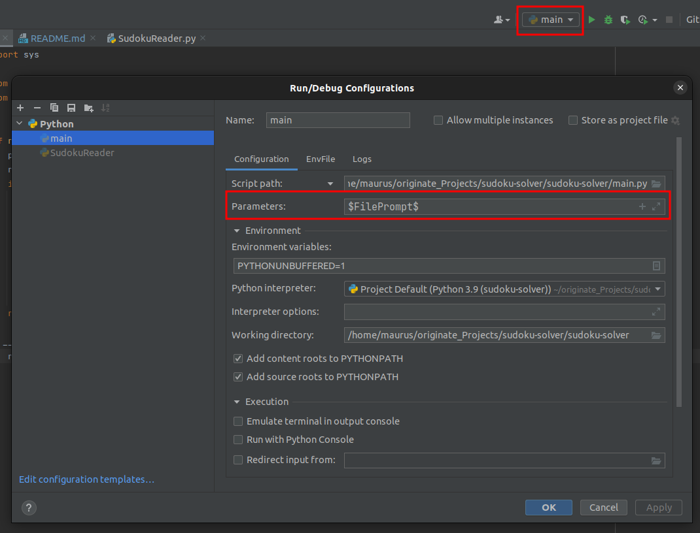

# Sudoku
Scripts to read a sudoku from an image, detect the filled in numbers and complete the sudoku.

### Used libraries
- OpenCV for reading and processing image data
- NumPy for mathematical, in particular array operations
- Matplotlib for displaying differents steps of the sudoku image processing
- Tensorflow for training and re-loading the CNN model
- Scikit-learn for evaluating the training of the CNN model
- warnings for warning if sudoku shape might be too large and lead to inconsistent placements of the digits

### SudokuReader
Class for reading a sudoku from a file. The largest quadrilateral contour is chosen as sudoku. In this contour, connected components are searched for. If the connected component satisfies certain shape criteria, it is assumed to be a digit. The digit is then classified using a neural network. 

### SudokuSolver
Class for solving a sudoku. A backtrack algorithm is used.

### NumberClassifier
A script for training a CNN for number classification. We use the pre-trained CNN `model-OCR.h5`. It can be run using the tensorflow/keras library:

```
import tensorflow as tf
my_model = tf.keras.models.load_model('model-OCR.h5')
```

### Usage
To use the script, use the main.py script. To do so, set the parameter of the run configuration of the main.py script to use a `$FilePrompt$`:



When you run `main.py`, you are asked to choose an image. If you want to run the script from the command line, one has to hand over the path to the image:

```bash
python3 main.py /path/to/image.jpg
```